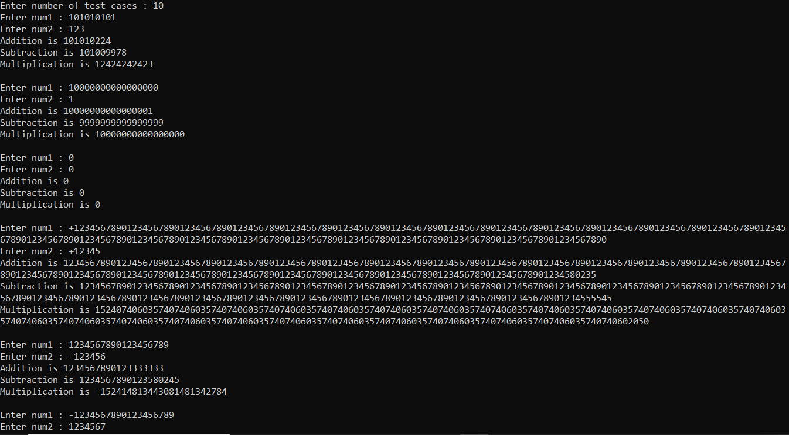
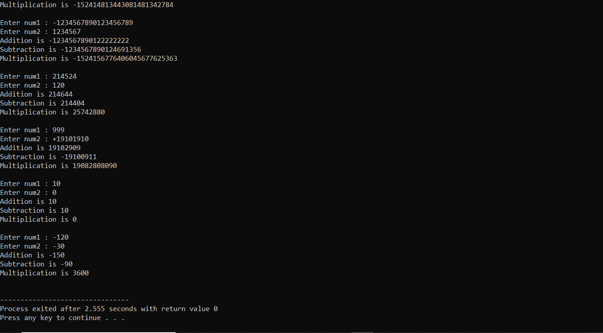

# BigInt Data Type in C

`BigInt` is implemented as an abstract data type using array of structures and strings.

## Features

- `BigInt` numbers can handle basic operations (+, -, *)

- They can store 1024 bit integers (or even higher).

- -(2^1024) = -1.79 * 10^308
\
This BigInt implementation follows base 10. Hence 310 digits are taken in order to support 1024 bit integer range. But the size can always be changed to work for integer of any size, by changing the `SIZE` macro.

## Assumptions

- Overflow is not handled. If the result exceeds SIZE, the result is truncated.

- The string input is assumed to be given correctly (first character may or may not represent the sign, but remaining characters should be in the range {'0' - '9'}), otherwise it gives invalid answers.

## Usage

`BigInt num;`
- creates a `BigInt` 'num'.

`initializeBigInt(&num);`
- intitializes the `BigInt` 'num' with 0.

`printBigInt(&num);`
- prints the `BigInt` 'num'.

`setBigInt(numString, &num);`
- intitializes the `BigInt` 'num' with a `char[]` 'numString'.

`add(num1, num2);`
- adds two `BigInt` types, 'num1' and 'num2', and returns the result as `BigInt`.

`sub(num1, num2);`
- subtracts two `BigInt` types, 'num1' and 'num2', and returns the result as `BigInt`.

`multi(num1, num2);`
- multiplies two `BigInt` types, 'num1' and 'num2', and returns the result as `BigInt`.

## Screen Shots

## Video Explanation
https://drive.google.com/file/d/1Z40YEjnwBMDmqGFFy3DnjQZfSlyq41nj/view?usp=sharing